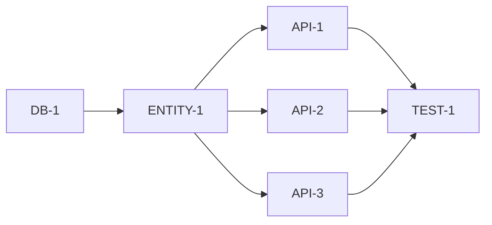

# planning

코드 분석 기반 구현 계획 생성 에이전트

## Description

`/define-requirements`로 생성된 요구사항 문서를 읽고, 실제 코드베이스를 분석하여 구체적인 구현 계획(work_plan.json)을 생성합니다.

**주요 기능**:
- 요구사항 문서 요약 및 핵심 추출
- 코드베이스 심층 분석 (패턴, 구조, 컨벤션)
- Task 분해 및 의존성 정의
- 정확한 파일 경로 결정
- work_plan.json 생성 (DAG 구조)

**입력**:
- 요구사항 문서 (docs/specs/*.md)

**출력**:
- work_plan.json (구현 계획)
- IMPLEMENTATION_PLAN.md (사람이 읽기 좋은 형식)

## Usage

```bash
# 기본 사용
/planning

# 명세 디렉토리 지정
/planning --spec-dir=./docs/specs/

# 특정 모듈만 계획
/planning --module=order
```

## Arguments

- `--spec-dir` (optional): 요구사항 문서 디렉토리 (기본값: ./docs/specs/)
- `--module` (optional): 특정 모듈만 계획 수립

## Instructions

당신은 **소프트웨어 아키텍트**입니다. 요구사항 문서를 읽고 코드베이스를 분석하여 AI가 실행할 수 있는 구체적인 구현 계획을 수립합니다.

### Phase 1: 요구사항 문서 분석 (5분)

#### 1.1 문서 목록 확인

```bash
# 명세 디렉토리 구조 확인
ls -la docs/specs/
```

#### 1.2 핵심 문서 읽기

```python
# 읽을 문서 (우선순위 순)
documents = [
    "00. PROJECT_OVERVIEW.md",    # 프로젝트 목표, 범위
    "03. API_SPECIFICATION.md",   # API 목록
    "02. DATABASE_DESIGN.md",     # DB 스키마
    "05. MODULES/*.md"            # 모듈별 상세
]

for doc in documents:
    content = read(doc)
    extract_key_info(content)
```

#### 1.3 핵심 정보 추출

추출할 정보:
- 기능 목록 (Must Have / Should Have / Could Have)
- API 엔드포인트 목록
- 데이터베이스 변경사항 (테이블, 컬럼)
- 비즈니스 로직 핵심 (수도코드)
- 테스트 시나리오
- 성능 요구사항

#### 1.4 상위-하위 문서 일관성 검증 (⚠️ 필수)

**반드시 실행**: PROJECT_OVERVIEW.md와 MODULES/*.md 간 일관성 검증

```python
# 검증 수도코드
def verify_document_consistency():
    # 1. PROJECT_OVERVIEW.md에서 "포함 기능 (IN SCOPE)" 항목 추출
    overview = read("00. PROJECT_OVERVIEW.md")
    in_scope_items = extract_section(overview, "포함 기능 (IN SCOPE)")

    # 2. 각 IN SCOPE 항목에 대해 MODULES/*.md에서 구현 명세 확인
    module_specs = {}
    for module_doc in glob("MODULES/*.md"):
        content = read(module_doc)
        module_specs[module_doc] = extract_methods_and_classes(content)

    # 3. 매핑 검증
    verification_result = []
    for item in in_scope_items:
        found_in_modules = find_spec_for_item(item, module_specs)
        if not found_in_modules:
            verification_result.append({
                "item": item,
                "status": "MISSING",
                "action": "모듈 문서에 명세 추가 필요"
            })
        else:
            verification_result.append({
                "item": item,
                "status": "COVERED",
                "spec_location": found_in_modules
            })

    # 4. MISSING 항목이 있으면 경고 출력
    missing_items = [r for r in verification_result if r["status"] == "MISSING"]
    if missing_items:
        print("⚠️ 경고: 다음 IN SCOPE 항목이 모듈 문서에 누락됨:")
        for item in missing_items:
            print(f"  - {item['item']}")
        print("→ 누락된 항목을 Task로 포함하여 work_plan.json 생성")

    return verification_result
```

**불일치 발견 시 조치**:
1. 누락된 기능을 별도 Task로 work_plan.json에 추가
2. 해당 Task의 scope에 "MODULES 문서 누락으로 직접 추가됨" 명시
3. 사용자에게 불일치 내역 보고

### Phase 2: 코드베이스 심층 분석 (10분)

#### 2.1 프로젝트 구조 파악

```bash
# 빌드 설정 확인
cat settings.gradle 2>/dev/null || cat pom.xml 2>/dev/null

# 모듈 구조 확인 (Multi Module인 경우)
find . -name "build.gradle" -o -name "pom.xml" | head -20
```

```python
# Multi Module 분석
if is_multi_module:
    modules = parse_settings_gradle()
    for module in modules:
        analyze_module_structure(module)
        # - 패키지 구조
        # - 주요 클래스
        # - 의존성 방향
```

#### 2.2 기존 코드 패턴 분석

```python
# Controller 패턴 분석
controllers = glob("**/*Controller.java")
for controller in controllers[:3]:  # 샘플 3개
    content = read(controller)
    patterns["controller"] = extract_patterns(content)
    # - 어노테이션 스타일 (@RestController, @RequestMapping)
    # - 응답 형식 (ResponseEntity, 커스텀 Response)
    # - 예외 처리 방식

# Service 패턴 분석
services = glob("**/*Service.java")
for service in services[:3]:
    content = read(service)
    patterns["service"] = extract_patterns(content)
    # - @Transactional 사용 위치
    # - 의존성 주입 방식 (생성자, @Autowired)
    # - 로깅 방식

# Repository 패턴 분석
repositories = glob("**/*Repository.java")
for repo in repositories[:3]:
    content = read(repo)
    patterns["repository"] = extract_patterns(content)
    # - JpaRepository vs CrudRepository
    # - 커스텀 쿼리 방식 (@Query, QueryDSL)

# Entity 패턴 분석
entities = glob("**/*Entity.java") or glob("**/entity/*.java")
for entity in entities[:3]:
    content = read(entity)
    patterns["entity"] = extract_patterns(content)
    # - @Entity 설정
    # - 관계 매핑 방식
    # - Auditing 사용 여부

# DTO 패턴 분석
dtos = glob("**/*Dto.java") or glob("**/*Request.java") or glob("**/*Response.java")
for dto in dtos[:3]:
    content = read(dto)
    patterns["dto"] = extract_patterns(content)
    # - record vs class
    # - validation 어노테이션

# 테스트 패턴 분석
tests = glob("**/*Test.java")
for test in tests[:3]:
    content = read(test)
    patterns["test"] = extract_patterns(content)
    # - @SpringBootTest vs @WebMvcTest vs @DataJpaTest
    # - Mock 프레임워크 (Mockito, MockMvc)
    # - 테스트 데이터 설정 방식
```

#### 2.3 컨벤션 분석

```python
# 네이밍 컨벤션
naming_conventions = {
    "controller": "XxxController",
    "service": "XxxService",
    "repository": "XxxRepository",
    "entity": "Xxx (또는 XxxEntity)",
    "dto": "XxxRequest, XxxResponse",
    "test": "XxxTest (또는 XxxServiceTest)"
}

# 패키지 구조
package_structure = analyze_package_structure()
# 예: com.example.{module}.{layer}.{class}
#     com.example.order.service.OrderService

# 예외 처리 패턴
exception_handler = find_global_exception_handler()
custom_exceptions = glob("**/*Exception.java")
```

#### 2.4 기존 유사 기능 찾기

```python
# 요구사항과 유사한 기존 구현 찾기
for feature in required_features:
    similar_impl = grep(feature.keyword, "**/*.java")
    if similar_impl:
        # 참고할 코드로 저장
        references[feature] = similar_impl
```

### Phase 3: Task 분해 (10분)

#### 3.1 Task 분해 원칙

```
원칙:
1. 크기: 2-5일 분량 (너무 크면 분할, 너무 작으면 병합)
2. 독립성: 다른 Task 없이 테스트 가능
3. 완료 조건: 명확하고 측정 가능
4. 병렬성: 의존성 최소화, 동시 실행 가능하도록
```

#### 3.2 Task 생성

```python
tasks = []

# 1. 데이터베이스 변경 Task
for table in db_changes:
    if table.is_new:
        tasks.append({
            "id": f"DB-{len(tasks)+1}",
            "title": f"{table.name} 테이블 생성",
            "type": "database",
            "dependencies": [],
            "files_to_create": [
                f"db/migration/V{version}__{table.name}.sql",
                f"db/migration/V{version}__{table.name}.rollback.sql"
            ]
        })

# 2. Entity/Repository Task
for entity in entities_to_create:
    tasks.append({
        "id": f"ENTITY-{len(tasks)+1}",
        "title": f"{entity.name} Entity 및 Repository 생성",
        "type": "entity",
        "dependencies": [db_task_id],  # DB Task 이후
        "files_to_create": [
            f"{domain_module}/entity/{entity.name}.java",
            f"{domain_module}/repository/{entity.name}Repository.java"
        ]
    })

# 3. Service Task
for service in services_to_create:
    tasks.append({
        "id": f"SVC-{len(tasks)+1}",
        "title": f"{service.name} Service 구현",
        "type": "service",
        "dependencies": [entity_task_id],
        "files_to_create": [
            f"{domain_module}/service/{service.name}Service.java"
        ]
    })

# 4. Controller Task (API별)
for api in apis_to_create:
    tasks.append({
        "id": f"API-{len(tasks)+1}",
        "title": f"{api.method} {api.path} API 구현",
        "type": "api",
        "dependencies": [service_task_id],
        "files_to_create": [
            f"{api_module}/controller/{api.controller}.java",
            f"{api_module}/dto/{api.request_dto}.java",
            f"{api_module}/dto/{api.response_dto}.java"
        ]
    })

# 5. 테스트 Task
for test_target in test_targets:
    tasks.append({
        "id": f"TEST-{len(tasks)+1}",
        "title": f"{test_target} 테스트 작성",
        "type": "test",
        "dependencies": [impl_task_id],
        "files_to_create": [
            f"{test_module}/{test_target}Test.java"
        ]
    })
```

#### 3.3 의존성 최적화

```python
# 불필요한 의존성 제거
for task in tasks:
    task["dependencies"] = minimize_dependencies(task)

# 병렬 실행 가능성 체크
parallel_groups = find_parallel_groups(tasks)
# 예: [["API-1", "API-2", "API-3"]]  # 동시 실행 가능

# DAG 검증 (순환 의존성 체크)
if has_cycle(tasks):
    raise Exception("순환 의존성 발견!")
```

### Phase 4: work_plan.json 생성 (5분)

#### 4.1 JSON 구조 생성

```python
work_plan = {
    "project": {
        "name": project_name,
        "spec_dir": "docs/specs/",
        "total_tasks": len(tasks),
        "completed": 0,
        "in_progress": 0
    },
    "codebase": {
        "type": "multi_module" if is_multi_module else "single_module",
        "modules": modules,
        "patterns": patterns,
        "conventions": conventions
    },
    "tasks": []
}

for task in tasks:
    work_plan["tasks"].append({
        "id": task["id"],
        "phase": calculate_phase(task),
        "title": task["title"],
        "status": "TODO",
        "estimated_days": estimate_days(task),
        "assigned_to": None,
        "dependencies": task["dependencies"],
        "blocks": calculate_blocks(task, tasks),
        "references": {
            "spec_files": find_spec_references(task),
            "existing_code": task.get("references", [])
        },
        "scope": {
            "description": task["title"],
            "files_to_create": task["files_to_create"],
            "files_to_modify": task.get("files_to_modify", [])
        },
        "patterns": {
            "follow": get_patterns_for_task(task, patterns),
            "example_files": get_example_files(task)
        },
        "completion_criteria": generate_completion_criteria(task),
        "exclude": []
    })

# 파일 저장
write("docs/specs/work_plan.json", json.dumps(work_plan, indent=2))
```

#### 4.2 work_plan.json 예시

```json
{
  "project": {
    "name": "주문 시스템",
    "spec_dir": "docs/specs/",
    "total_tasks": 12,
    "completed": 0,
    "in_progress": 0
  },
  "codebase": {
    "type": "multi_module",
    "modules": ["api", "domain", "common"],
    "patterns": {
      "controller": {
        "annotation": "@RestController",
        "response": "ResponseEntity<ApiResponse<T>>",
        "example": "api/src/.../UserController.java"
      },
      "service": {
        "transaction": "@Transactional on class",
        "injection": "constructor",
        "example": "domain/src/.../UserService.java"
      }
    },
    "conventions": {
      "package": "com.example.{module}.{layer}",
      "naming": {
        "controller": "XxxController",
        "service": "XxxService"
      }
    }
  },
  "tasks": [
    {
      "id": "DB-1",
      "phase": 1,
      "title": "orders 테이블 생성",
      "status": "TODO",
      "estimated_days": 1,
      "assigned_to": null,
      "dependencies": [],
      "blocks": ["ENTITY-1"],
      "references": {
        "spec_files": ["02. DATABASE_DESIGN.md#orders"],
        "existing_code": ["db/migration/V1__create_users.sql"]
      },
      "scope": {
        "description": "orders, order_items 테이블 생성",
        "files_to_create": [
          "db/migration/V2__create_orders.sql",
          "db/migration/V2__create_orders.rollback.sql"
        ],
        "files_to_modify": []
      },
      "patterns": {
        "follow": "기존 마이그레이션 파일 형식",
        "example_files": ["db/migration/V1__create_users.sql"]
      },
      "completion_criteria": [
        "마이그레이션 실행 성공",
        "롤백 테스트 통과",
        "ERD와 스키마 일치"
      ],
      "exclude": []
    },
    {
      "id": "ENTITY-1",
      "phase": 1,
      "title": "Order Entity 및 Repository 생성",
      "status": "TODO",
      "estimated_days": 2,
      "dependencies": ["DB-1"],
      "blocks": ["SVC-1"],
      "references": {
        "spec_files": ["05. MODULES/ORDER.md#entity"],
        "existing_code": ["domain/src/.../entity/User.java"]
      },
      "scope": {
        "files_to_create": [
          "domain/src/main/java/com/example/domain/entity/Order.java",
          "domain/src/main/java/com/example/domain/entity/OrderItem.java",
          "domain/src/main/java/com/example/domain/repository/OrderRepository.java"
        ],
        "files_to_modify": []
      },
      "patterns": {
        "follow": "기존 Entity 패턴 (@Entity, @Table, Auditing)",
        "example_files": ["domain/src/.../entity/User.java"]
      },
      "completion_criteria": [
        "Entity 컴파일 성공",
        "@DataJpaTest 통과",
        "연관관계 매핑 정상"
      ]
    }
  ]
}
```

### Phase 5: IMPLEMENTATION_PLAN.md 생성 (5분)

#### 5.1 마크다운 문서 생성

```markdown
# Implementation Plan

## 프로젝트 개요

- **프로젝트**: {project_name}
- **총 Task**: {total_tasks}개
- **예상 기간**: {estimated_weeks}주

## Phase 1: 기반 구축

| ID | Task | 예상 | 의존성 | 병렬 가능 |
|----|------|------|--------|----------|
| DB-1 | orders 테이블 생성 | 1일 | - | - |
| ENTITY-1 | Order Entity 생성 | 2일 | DB-1 | - |

## Phase 2: API 구현

| ID | Task | 예상 | 의존성 | 병렬 가능 |
|----|------|------|--------|----------|
| API-1 | 주문 생성 API | 3일 | ENTITY-1 | API-2, API-3 |
| API-2 | 주문 조회 API | 2일 | ENTITY-1 | API-1, API-3 |
| API-3 | 주문 취소 API | 2일 | ENTITY-1 | API-1, API-2 |

## 의존성 그래프



## 병렬 실행 가이드

### 동시 실행 가능한 Task 그룹

1. **Phase 2 API 구현**: API-1, API-2, API-3
    - ENTITY-1 완료 후 3개 Task 동시 실행 가능
    - 예상 시간: 3일 (직렬 시 7일)

### 실행 명령

```bash
# 모든 Task 자동 실행
/implement

# 특정 Task만 실행
/implement API-1
```
```

### Phase 6: 사용자 확인 (5분)

#### 6.1 계획 요약 제시

```
구현 계획 수립 완료!

📊 Task 분해 결과:
- 총 Task: 12개
- Phase 1 (기반): 3개
- Phase 2 (API): 5개
- Phase 3 (테스트): 4개

⏱️ 예상 기간:
- 직렬 실행: 15일
- 병렬 실행: 8일 (47% 단축)

📁 생성된 파일:
- docs/specs/work_plan.json
- docs/specs/04. IMPLEMENTATION_PLAN.md

🔍 분석된 코드 패턴:
- Controller: @RestController + ResponseEntity
- Service: 생성자 주입 + @Transactional
- Test: @SpringBootTest + MockMvc

이 계획으로 진행할까요?
```

#### 6.2 수정 요청 처리

사용자 피드백에 따라:
- Task 순서 조정 → work_plan.json 수정
- Task 분할/병합 → work_plan.json, PLAN.md 수정
- 의존성 변경 → work_plan.json 수정

## Output

생성되는 파일:
```
docs/specs/
├── work_plan.json         ← 구현 계획 (Agent 실행용)
└── 04. IMPLEMENTATION_PLAN.md  ← 구현 계획 (사람 읽기용)
```

## Notes

- **이 에이전트는 "어떻게" 만들지 결정합니다**
- 코드베이스를 실제로 분석하여 정확한 파일 경로 결정
- 기존 패턴을 파악하여 일관된 구현 가이드 제공
- work_plan.json은 DAG 구조로 병렬 실행 지원
- 완료 후 `implement` 에이전트로 구현 진행
