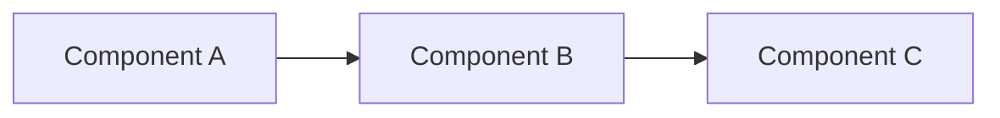
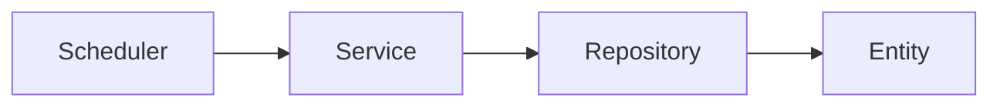
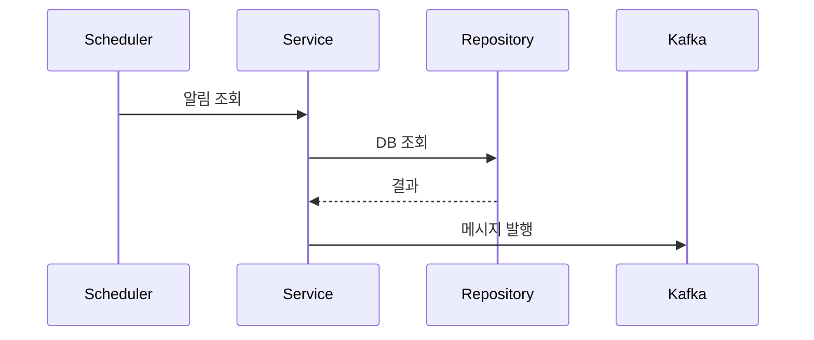

# pr-description

변경사항을 분석하여 PR description을 생성합니다.

---

## Step 1: 정보 수집

```bash
# JIRA ID (브랜치명에서 추출)
git branch --show-current

# 변경 파일 목록
git diff main --name-only

# 커밋 로그
git log main..HEAD --oneline
```

---

## Step 2: 변경사항 분석

1. 변경된 파일 읽기
2. 주요 변경 내용 파악
3. 아키텍처 변경 여부 확인 (Mermaid 필요 여부)

---

## Step 3: PR Description 생성

### 템플릿

```markdown
## JIRA
[{JIRA-ID}](https://your-company.atlassian.net/browse/{JIRA-ID})

## Summary
{이 PR이 해결하는 문제 또는 추가하는 기능 1-2문장 요약}

## Changes
- {변경사항 1}
- {변경사항 2}
- {변경사항 3}

## Architecture (선택)
{아키텍처 변경, 흐름 변경, 의존성 변경이 있을 경우에만 포함}


```

### Mermaid 포함 기준

다음 경우에 Mermaid 다이어그램 추가:
- 새로운 모듈/패키지 추가
- 클래스 간 의존성 변경
- 데이터 흐름 변경
- 스케줄러/배치 처리 흐름

### Mermaid 예시

**클래스 의존성:**


**처리 흐름:**


---

## Step 4: 결과 출력

```
PR_DESCRIPTION_GENERATED

## JIRA
[PROJ-123](https://your-company.atlassian.net/browse/PROJ-123)

## Summary
...

## Changes
...
```

---

## 체크리스트

- [ ] JIRA ID 포함됨
- [ ] Summary가 명확함
- [ ] Changes가 구체적임
- [ ] 아키텍처 변경 시 Mermaid 포함됨
