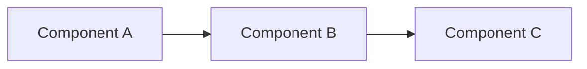

# pr-description

변경사항을 분석하여 PR description을 생성합니다.

---

## Step 1: 정보 수집

> **중요: 호출자가 base branch와 head branch를 전달한 경우 반드시 그 값을 사용한다. `main`을 하드코딩하지 않는다.**

호출자가 전달한 prompt에서 아래 정보를 추출한다:
- `base_branch`, `head_branch`
- `jira_id`, `jira_url`
- `owner/repo`
- `commit_log` (커밋 목록)
- `diff_stat` (변경 파일 통계)

추가로 변경된 파일 목록을 조회한다:

```bash
git diff origin/{base_branch}..origin/{head_branch} --name-only
```

---

## Step 2: 변경사항 분석

1. **변경된 파일 읽기** — 최대 **10개**까지만 읽는다. 10개 초과 시 `diff_stat`과 `commit_log`를 기반으로 분석한다.
2. 주요 변경 내용 파악
3. 아키텍처 변경 여부 확인 (Mermaid 필요 여부)

---

## Step 3: PR Description 생성

### 템플릿

```markdown
## JIRA
[{JIRA_ID}](https://triplecomma.atlassian.net/browse/{JIRA_ID})

## Summary
{이 PR이 해결하는 문제 또는 추가하는 기능 1-2문장 요약}

## Changes
- {변경사항 1}
- {변경사항 2}
- {변경사항 3}

## Architecture (선택)
{새로운 모듈/패키지 추가 시에만 포함. 기존 코드 수정, 삭제, 리팩토링에는 포함하지 않는다}


```mermaid
graph LR
    A[Component A] --> B[Component B]
    B --> C[Component C]
```
```

### Mermaid 포함 기준

다음 경우에**만** Mermaid 다이어그램을 추가한다:
- **새로운 모듈/패키지 추가** 시

다음 경우에는 Mermaid를 포함하지 **않는다**:
- 기존 코드 수정/삭제
- 설정 변경
- 리팩토링
- 클래스 간 의존성 변경 (신규 모듈이 아닌 경우)

### 작성 규칙

- **한국어**로 작성한다
- Summary는 1-2문장으로 간결하게
- Changes는 구체적인 변경 내용을 bullet으로 나열
- JIRA 섹션은 **반드시** 포함한다

---

## Step 4: 결과 출력

> **중요: 반드시 아래 마커로 감싸서 출력한다. 마커 밖에 다른 텍스트를 넣지 않는다.**

```
PR_DESCRIPTION_START
## JIRA
[{JIRA_ID}]({jira_url})

## Summary
...

## Changes
...
PR_DESCRIPTION_END
```

- `PR_DESCRIPTION_START` 바로 다음 줄부터 마크다운 내용이 시작된다
- `PR_DESCRIPTION_END` 바로 이전 줄까지가 마크다운 내용이다
- 마커 자체는 PR description에 포함되지 않는다

---

## 체크리스트

- [ ] JIRA ID 포함됨
- [ ] Summary가 명확함
- [ ] Changes가 구체적임
- [ ] 새 모듈 추가 시에만 Mermaid 포함됨
- [ ] PR_DESCRIPTION_START / PR_DESCRIPTION_END 마커로 감싸져 있음
- [ ] 한국어로 작성됨
- [ ] 변경 파일 읽기가 10개 이하로 제한됨
