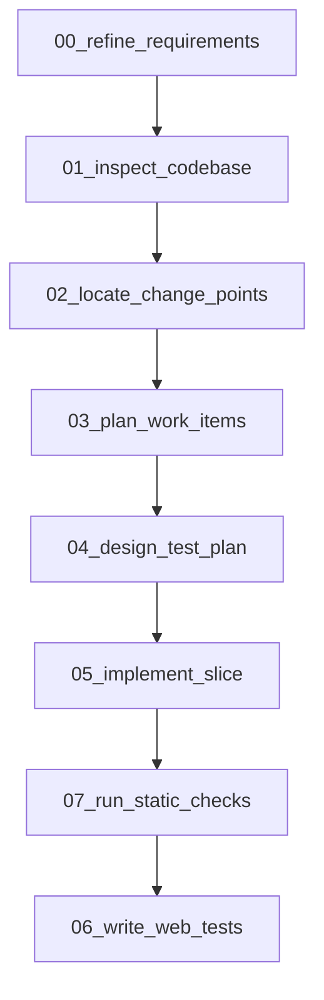
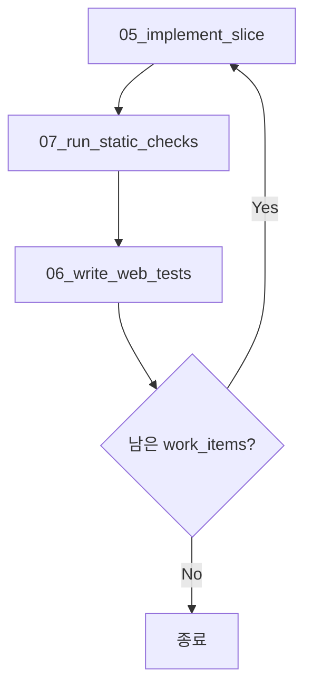
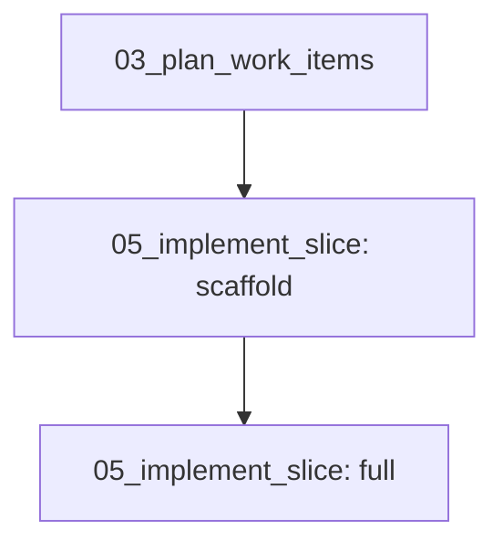

# Codex Skills Guide

## 스킬 설명

- 00_refine_requirements: 사용자 요구사항을 개발 및 테스트 가능한 명확한 명세로 정제한다
- 01_inspect_codebase: 현재 코드베이스의 구조, 진입점, 설정, 테스트/빌드 구성을 사실 기반으로 요약한다
- 02_locate_change_points: 요구사항과 코드베이스 분석 결과를 바탕으로 변경이 필요한 지점을 식별한다 (plan_work_items 입력 최적화)
- 03_plan_work_items: 변경 지점 분석을 바탕으로 작업을 PR 단위로 분해하고 ISSUE_ID/STATUS를 포함한 실행 계획(JSON)을 생성한다. 결과물의 모든 문자열 값은 한국어로 작성한다.
- 04_design_test_plan: PR 단위 작업 계획을 바탕으로 테스트 전략과 PR별 테스트 게이트를 정의한다 (Unit / Web / Integration)
- 05_implement_slice: work_plan(JSON)에서 다음 작업(PR)을 자동 선택하여 구현하고, 완료된 작업을 DONE으로 전환한다
- 06_write_web_tests: Controller 계층에 대한 Web 테스트(MockMvc)를 작성한다
- 07_run_static_checks: 구현된 코드 변경에 대해 컴파일 및 정적 검증 결과를 점검한다

## 피처 개발 실행 순서



## 반복 실행 순서 (구현/검증 루프)



## 스캐폴딩 포함 흐름 (선택)



## 단계별 입력/출력 매핑

| 단계                      | 주요 출력물                                                       | 다음 단계 입력으로 사용하는 항목                                                       |
|-------------------------|--------------------------------------------------------------|--------------------------------------------------------------------------|
| 00_refine_requirements  | `./docs/features/{feature_name}/artifacts/{output_filename}` | 01_inspect_codebase: `refined_requirements_filename`                     |
| 01_inspect_codebase     | `./docs/features/{feature_name}/artifacts/{output_filename}` | 02_locate_change_points: `codebase_context_filename`                     |
| 02_locate_change_points | `./docs/features/{feature_name}/artifacts/{output_filename}` | 03_plan_work_items: `change_points_filename`                             |
| 03_plan_work_items      | `./docs/features/{feature_name}/artifacts/{output_filename}` | 04_design_test_plan: `work_plan_filename`                                |
| 04_design_test_plan     | `./docs/features/{feature_name}/artifacts/{output_filename}` | 06_write_web_tests: `test_plan`                                          |
| 05_implement_slice      | work_plan 상태 업데이트, 코드 변경                                     | 06_write_web_tests: `code_changes`, 07_run_static_checks: `code_changes` |
| 06_write_web_tests      | 테스트 코드 변경                                                    | 07_run_static_checks: 코드 변경 포함 여부 판단                                     |
| 07_run_static_checks    | 정적 검증 결과 요약                                                  | 05_implement_slice 재실행 또는 종료 판단                                          |

## 실행 권고

- 기획 단계는 다음 형태로 실행하도록 권고한다.

```sh
cat <<'PROMPT' | codex exec --sandbox workspace-write -
<요구사항 입력>
PROMPT
```

- 실제 코딩 단계는 Codex CLI 세션을 통해 실행할 것을 권고한다.